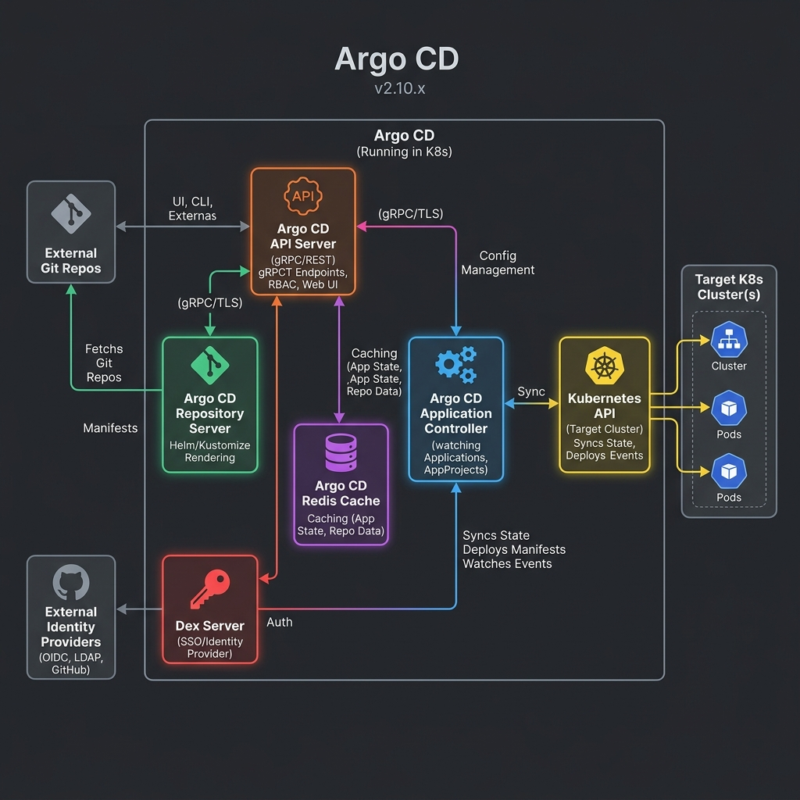

# GitOps with Argo CD

A practical guide to understanding GitOps and implementing real-world Kubernetes deployments using Argo CD.

## Introduction

This repo is a hands-on learning resource for **GitOps**: operating Kubernetes
applications where **Git is the single source of truth** and an in-cluster agent
(**Argo CD**) continuously reconciles the cluster to match the repository. It
covers the concepts, a secure Argo CD setup, application patterns, production
features, runnable examples, and troubleshooting.

## What this repo covers

- GitOps fundamentals and how it differs from traditional deployment
- Argo CD architecture, installation, and secure access (TLS, AppProjects)
- Argo CD Applications: sources, destinations, and sync behaviour
- Production patterns: App of Apps, ApplicationSet, sync waves, resource hooks
- Kustomize and Helm with Argo CD
- The end-to-end CI + GitOps flow
- Multi-cluster hub-and-spoke deployments with one Argo CD control plane
- Practical, self-contained examples and a troubleshooting guide

## Architecture



## Learning roadmap

1. **Fundamentals** — `docs/01`–`docs/05`
2. **Argo CD basics** — `docs/06`–`docs/08`
3. **Secure access** — `docs/09`
4. **Applications** — `docs/10`–`docs/13`
5. **Production patterns** — `docs/14`–`docs/19`
6. **CI + GitOps flow** — `docs/20`
7. **Troubleshooting** — `docs/21`
8. **Multi-cluster hub model** — `docs/22`

Work through the [`examples/`](examples/) folder alongside the docs, in order.

## Tools used

- Kubernetes
- Argo CD
- Kustomize & Helm
- Git / GitHub
- (Later) GitHub Actions for CI — see the companion `ci-with-github-actions` repo

## Folder structure

```
gitops-with-argocd/
├── README.md      # this landing page
├── docs/          # concept + how-to guides (01–22)
├── examples/      # small, self-contained Argo CD demos (01–10)
├── manifests/     # reusable YAML (install, apps, ingress-tls)
├── assets/        # diagrams and screenshots
└── notes/         # scratch notes and handy commands
```

## How to use this repo

1. Read the docs in [`docs/`](docs/) in numeric order.
2. Apply the matching example under [`examples/`](examples/) to your own cluster.
3. Reuse the base YAML in [`manifests/`](manifests/) as starting points.

> Note: the manifests and examples are written to be correct by convention. Update the `repoURL` fields to your
> fork before applying. See each example's README for exact commands.

## Status / roadmap

Content, visual assets, and manifest schema verification are complete:

- [x] Fundamentals docs (01–05)
- [x] Argo CD basics + secure access (06–09)
- [x] Applications & sync (10–13)
- [x] Production patterns (14–19)
- [x] CI + GitOps flow (20)
- [x] Troubleshooting (21)
- [x] Multi-cluster hub model (22)
- [x] Examples (01–10)
- [x] ApplicationSet examples — 5 generators (09)
- [x] Hub-and-spoke ApplicationSet example (10)
- [x] Manifests (install, apps, ingress-tls)
- [x] Diagrams & screenshots
- [x] Verify manifests & examples (static schema & syntax validation)
