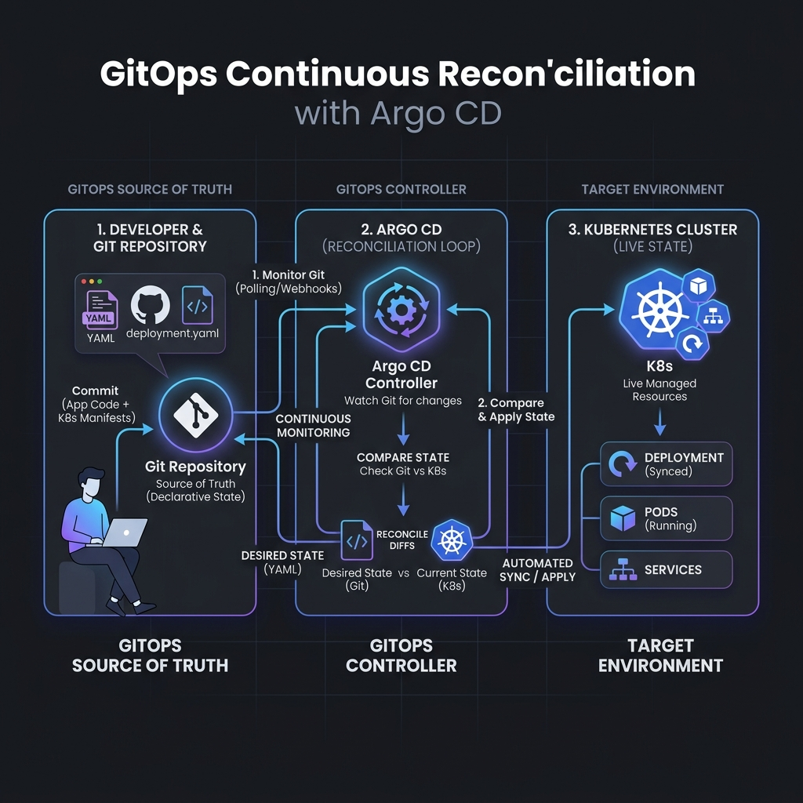

# What Is GitOps?

**GitOps** is a way of operating infrastructure and applications where the desired
state of your system is described **declaratively**, stored in **Git**, and
automatically **reconciled** into the running environment by software. Git becomes
the single source of truth: if it isn't in Git, it isn't part of the system.

## The four principles

GitOps is usually summarised with four principles (as defined by the OpenGitOps
project):

1. **Declarative** — the entire system is described declaratively. You state *what*
   you want (e.g. "3 replicas of this image"), not the imperative steps to get there.
2. **Versioned and immutable** — the desired state is stored in Git, giving you a
   complete, versioned, immutable history. Every change is a commit.
3. **Pulled automatically** — approved changes to the desired state are pulled into
   the system automatically, without applying manually.
4. **Continuously reconciled** — software agents continuously observe the live
   state and reconcile it back to the desired state, correcting any drift.

## Why Git as the source of truth?

Using Git for desired state gives you, for free, everything Git already does well:

- **Auditability** — every change has an author, a timestamp, and a message.
- **Reviewability** — changes go through pull requests and approvals.
- **Rollback** — reverting is a `git revert`; the agent redeploys the old state.
- **Reproducibility** — the cluster can be rebuilt from the repo at any time.
- **Collaboration** — the same workflow developers already use for code.

## A simple mental model



```
Desired state (Git)  ──►  Reconciler / Agent  ──►  Live state (Kubernetes)
        ▲                                                    │
        └──────────────── observed drift ────────────────────┘
```

The reconciler's only job is to make the live state equal the desired state, and to
keep it that way. The reconciler is an automated GitOps agent running inside or alongside the target environment.

## What GitOps is *not*

- It is **not** just "storing YAML in Git." Storing manifests in Git and then
  applying manually or running direct imperative commands from a CI pipeline is *pipeline-driven CD*, not GitOps —
  there is no continuous reconciliation and drift is not corrected.
- It is **not** limited to application deployment; it applies equally to cluster
  configuration, infrastructure, and policy.

## Next

- [02 — GitOps vs Traditional Deployment](02-gitops-vs-traditional-deployment.md)
- [03 — Push-based vs Pull-based Deployment](03-push-vs-pull-based-deployment.md)

## References

- OpenGitOps principles — https://opengitops.dev/
