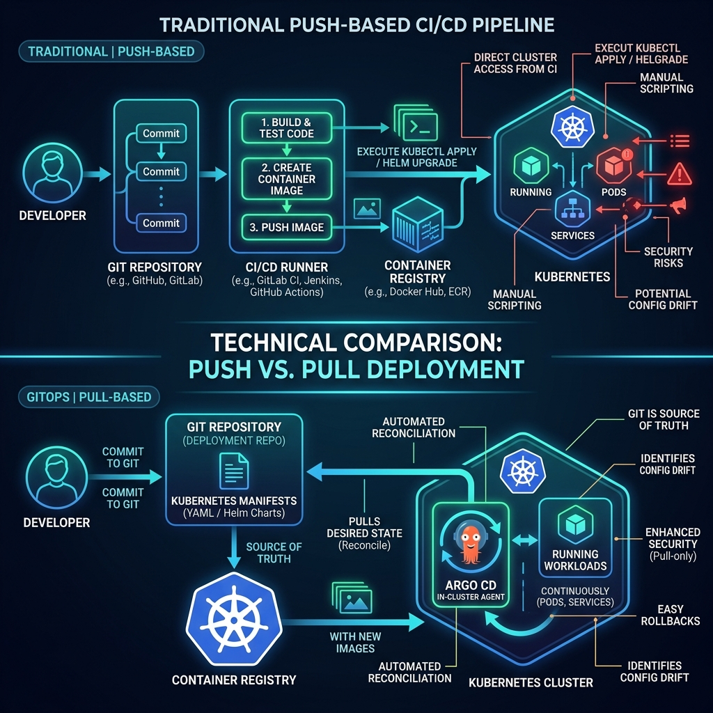

# GitOps vs Traditional Deployment

Both traditional CI/CD and GitOps aim to get code into production safely and
repeatably. The difference is **who applies the change** and **where the source of
truth lives**.

## Traditional (pipeline-driven) deployment

In a classic pipeline the CI/CD system has credentials to the cluster and *pushes*
changes:

```
git push ─► CI builds & tests ─► CD pipeline runs deployment commands (e.g. kubectl apply / helm upgrade)
```

Characteristics:

- The pipeline holds **cluster credentials** and reaches into the cluster.
- The "real" desired state is whatever the pipeline last ran — not necessarily what
  is in Git.
- **Drift** (someone edits cluster resources manually) is invisible and uncorrected.
- Rollbacks mean re-running an older pipeline.

## GitOps deployment

In GitOps an in-cluster agent *pulls* the desired state from Git and reconciles it:

```
git push ─► GitOps agent detects change ─► agent syncs cluster to match Git
```

Characteristics:

- Git is the **single source of truth**; the cluster is continuously reconciled to
  match it.
- The agent runs **inside** the cluster, so external CI systems don't need cluster
  credentials.
- **Drift is detected and (optionally) auto-corrected** — out-of-sync state is detected
  and reconciliation can revert manual changes.
- Rollback is `git revert`.

## Visual Comparison



## Side-by-side

| Aspect                | Traditional CI/CD          | GitOps                         |
| --------------------- | -------------------------- | ------------------------------ |
| Source of truth       | The pipeline / cluster     | Git                            |
| Change applied by     | CI/CD pushes into cluster  | In-cluster agent pulls         |
| Cluster credentials   | Held by CI system          | Stay inside the cluster        |
| Drift handling        | Usually undetected         | Detected, optionally corrected |
| Rollback              | Re-run old pipeline        | `git revert`                   |
| Audit trail           | Pipeline logs              | Git history                    |

## Where CI still fits

GitOps replaces the **CD** half, not the **CI** half. You still build, test, scan,
and push images in CI. CI's final job becomes *updating the manifest/image tag in
Git* — after that, the GitOps agent takes over. See
[20 — CI and GitOps Flow](20-ci-and-gitops-flow.md).

## References

- OpenGitOps principles — https://opengitops.dev/
