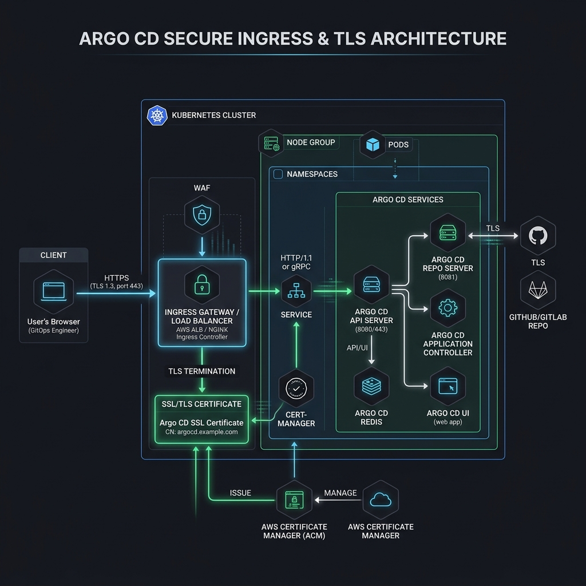

# Securing Argo CD with Ingress + TLS

Argo CD holds credentials to your clusters and repositories. Exposing it carelessly
is a serious risk. This is the **DevSecOps** section: making Argo CD work *and*
securing access properly.

## Why not expose Argo CD publicly without protection

The Argo CD API server can create, modify, and delete workloads across clusters. An
unprotected, internet-facing instance is effectively a remote-code-execution path
into your infrastructure. Always put it behind TLS, authentication, and network
controls, and prefer private/VPN access where possible.

## HTTPS/TLS for the UI



Terminate TLS in front of `argocd-server`. Two common approaches:

- **Terminate at the Ingress** — the Ingress holds the certificate; run
  `argocd-server` with `--insecure` (it speaks plain HTTP behind the proxy).
- **Passthrough** — the Ingress passes TLS through to `argocd-server`, which serves
  its own certificate.

## AWS ALB Ingress with ACM certificate

On EKS with the AWS Load Balancer Controller:

1. Request/validate a certificate in **AWS Certificate Manager (ACM)** for your
   hostname (e.g. `argocd.example.com`).
2. Annotate the Ingress to use an `alb` and reference the ACM cert ARN:
   ```yaml
   annotations:
     kubernetes.io/ingress.class: alb
     alb.ingress.kubernetes.io/scheme: internet-facing   # or internal
     alb.ingress.kubernetes.io/listen-ports: '[{"HTTPS":443}]'
     alb.ingress.kubernetes.io/certificate-arn: arn:aws:acm:REGION:ACCOUNT:certificate/ID
     alb.ingress.kubernetes.io/backend-protocol: HTTPS
   ```
3. Run `argocd-server` appropriately for terminate vs passthrough.

See [`manifests/ingress-tls/argocd-ingress.yaml`](../manifests/ingress-tls/argocd-ingress.yaml).

## Route 53 DNS setup

Point a Route 53 **A/ALIAS record** for `argocd.example.com` at the ALB's DNS name.
With ExternalDNS installed you can automate this with a hostname annotation.

## Admin password handling

- Retrieve the initial password from `argocd-initial-admin-secret`, then **change
  it** and delete the initial secret.
- For real teams, **disable the local admin** and use SSO (OIDC/Dex) instead.
- Never commit passwords to Git; use a secrets manager or sealed/external secrets.

## RBAC

Argo CD RBAC (`argocd-rbac-cm`) maps users/groups to permissions on projects and
applications. Grant least privilege — e.g. a read-only role for most users:

```
p, role:readonly, applications, get, */*, allow
g, my-org:viewers, role:readonly
```

See [`manifests/rbac/readonly-user-rbac.yaml`](../manifests/rbac/readonly-user-rbac.yaml)
and [12 — AppProject](12-appproject.md).

## AppProject restrictions

Use `AppProject` to constrain **which repos** an app may deploy from, **which
clusters/namespaces** it may target, and **which resource kinds** it may create.
This limits blast radius even if an application is misconfigured.

## Private GitHub repo access

Register private repositories with credentials so the repo server can clone them:

- **HTTPS + token** — a GitHub personal access token or fine-grained token:
  ```bash
  argocd repo add https://github.com/ORG/REPO.git \
    --username <user> --password <token>
  ```
- **SSH key** — add a deploy key and register it:
  ```bash
  argocd repo add git@github.com:ORG/REPO.git --ssh-private-key-path ./deploy_key
  ```

Declaratively, credentials live in Kubernetes Secrets labelled
`argocd.argoproj.io/secret-type: repository` (or `repo-creds`).

## Next

- [10 — The Argo CD Application](10-argocd-application.md)
