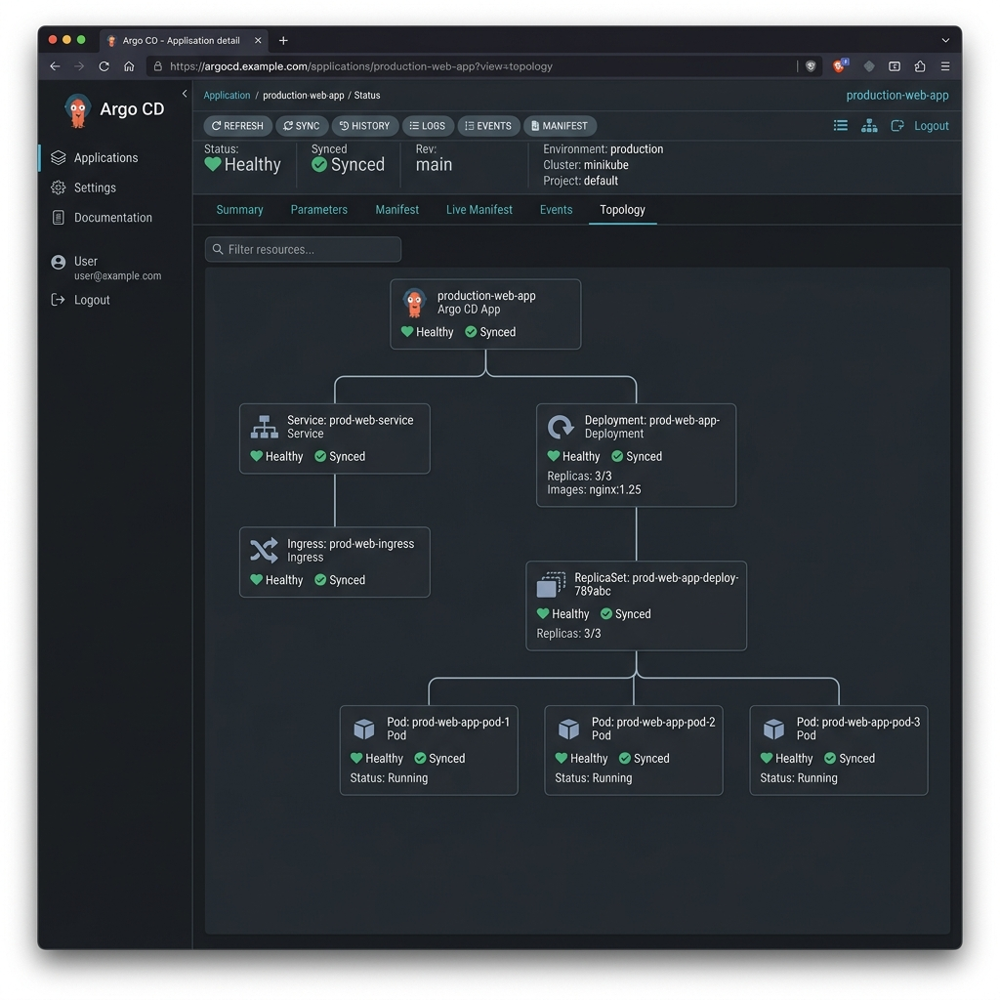
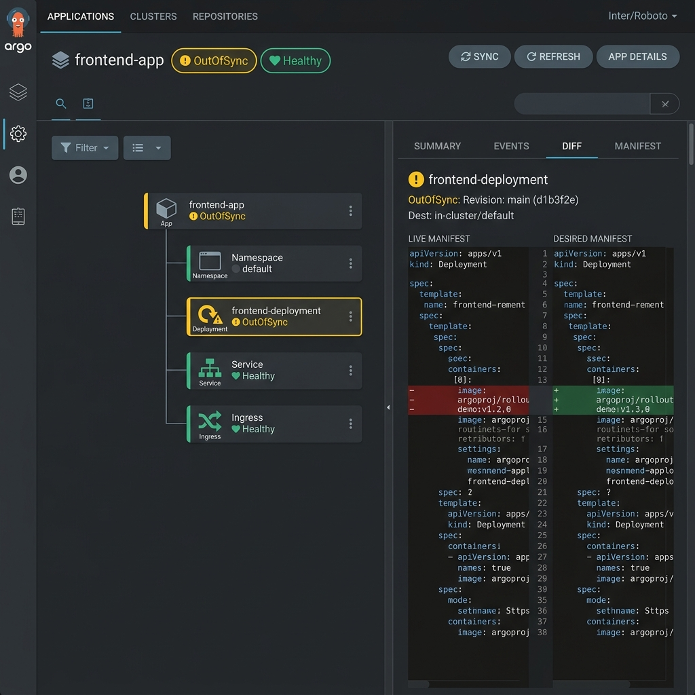

# The Argo CD Application

An **Application** is the core Argo CD object. It answers three questions:
*what to deploy* (source), *where to deploy it* (destination), and *how to keep it
in sync* (sync policy). It is a Kubernetes CRD, so you can create it declaratively.

## A minimal Application

```yaml
apiVersion: argoproj.io/v1alpha1
kind: Application
metadata:
  name: nginx-app
  namespace: argocd            # Applications live in the argocd namespace
spec:
  project: default
  source:
    repoURL: https://github.com/awaismansha-00/gitops-with-argocd.git
    targetRevision: main
    path: examples/01-basic-nginx-app
  destination:
    server: https://kubernetes.default.svc
    namespace: nginx
  syncPolicy:
    automated:
      selfHeal: true
      prune: true
    syncOptions:
      - CreateNamespace=true
```

## Visual Topology & Sync Status

| Healthy & Synced State | OutOfSync State |
| :---: | :---: |
|  |  |

## Key fields

### `spec.source`
- **`repoURL`** — the Git repository (or Helm/OCI registry) holding the desired
  state.
- **`targetRevision`** — the branch, tag, or commit SHA to track (e.g. `main`,
  `v1.2.0`, `HEAD`). This is the "pinned version" of your desired state.
- **`path`** — the directory *inside* the repo to render (plain YAML, Kustomize, or
  Helm). For Helm/OCI charts you use `chart` instead.

### `spec.destination`
- **`server`** — the target cluster API URL. `https://kubernetes.default.svc` means
  "the same cluster Argo CD runs in." Remote clusters are registered and referenced
  by URL or `name`.
- **`namespace`** — the namespace to deploy into. Combine with
  `syncOptions: [CreateNamespace=true]` to have Argo CD create it.

### `spec.project`
The `AppProject` this Application belongs to — its governance boundary. `default`
allows everything; real setups use a scoped project. See
[12 — AppProject](12-appproject.md).

### `spec.syncPolicy`
How reconciliation behaves — automated vs manual, self-heal, prune. See
[13 — Sync Policies](13-sync-policies.md).

## Multiple sources

An Application can also declare `spec.sources` (plural) to combine, for example, a
Helm chart from one repo with values from another. This underpins several
production patterns.

## Next

- [11 — QA and Prod Applications](11-qa-prod-applications.md)
- [13 — Sync Policies](13-sync-policies.md)
