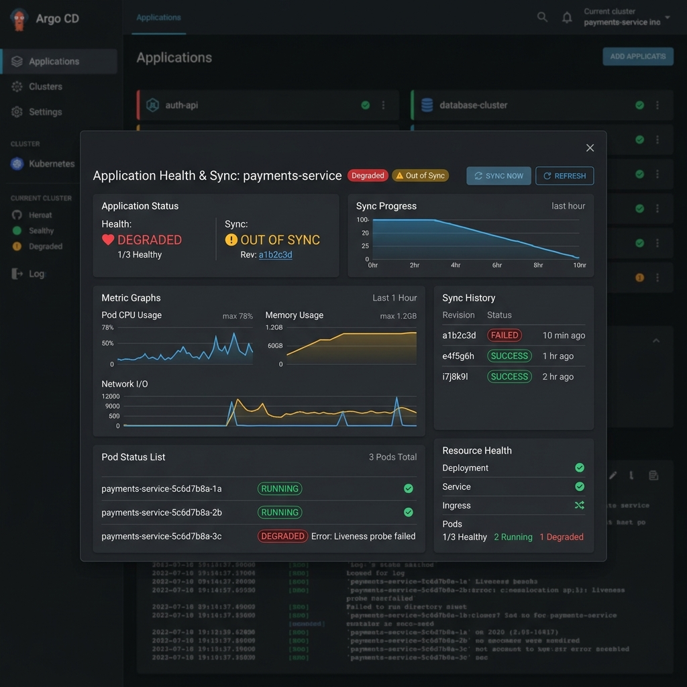

# Troubleshooting

Common Argo CD problems and how to diagnose them. General first steps:

```bash
argocd app get <app>            # sync + health summary and conditions
argocd app diff <app>           # desired vs live differences
kubectl -n argocd logs deploy/argocd-repo-server
kubectl -n argocd logs statefulset/argocd-application-controller
kubectl -n <ns> get events --sort-by=.lastTimestamp
```



## Application stuck OutOfSync
- **Cause:** desired ≠ live, and sync hasn't run (manual policy) or a resource can't
  be applied.
- **Fix:** run `argocd app diff <app>` to see *what* differs. If manual, click
  **Sync** / `argocd app sync <app>`. Check for immutable-field changes (some fields
  require replace) or a mutating webhook adding fields — use
  `ignoreDifferences` for controller-managed fields.

## Application Degraded
- **Cause:** resources were applied but aren't healthy (crashing pods, failed
  rollout).
- **Fix:** `kubectl -n <ns> get pods`, then `describe`/`logs` the failing pod. See
  ImagePullBackOff / CrashLoopBackOff below.

## Repo authentication failed
- **Cause:** private repo without valid credentials, expired token, or wrong URL.
- **Fix:** `argocd repo list`; re-add with a valid token/SSH key
  (`argocd repo add ...`). Check the repo-server logs. See
  [09 — Securing Argo CD](09-secure-argocd-with-ingress-tls.md).

## Namespace does not exist
- **Cause:** destination namespace isn't present and Argo CD isn't creating it.
- **Fix:** add `syncOptions: [CreateNamespace=true]`, or create the namespace in Git
  as a resource (often in an earlier [sync wave](14-sync-waves.md)).

## Invalid destination / server
- **Cause:** `destination.server` points at an unregistered cluster, or the project
  doesn't permit that destination.
- **Fix:** use `https://kubernetes.default.svc` for the local cluster, or register
  the remote cluster (`argocd cluster add`). Confirm the destination is allowed by
  the [AppProject](12-appproject.md).

## Private repo access issue
- **Cause:** missing/incorrect repository credentials Secret.
- **Fix:** verify the `repository`/`repo-creds` Secret labels and contents; test
  with `argocd repo get <url>`.

## ImagePullBackOff
- **Cause:** image name/tag wrong, or registry auth missing.
- **Fix:** confirm the tag exists; add an `imagePullSecret` for private registries;
  check for typos in the image reference (often a bad tag from CI).

## CrashLoopBackOff
- **Cause:** the container starts then exits (bad config, missing env/secret, failed
  migration).
- **Fix:** `kubectl logs <pod> --previous`; check ConfigMaps/Secrets and readiness
  probes. If a migration hook failed, inspect the hook Job.

## Ingress not working
- **Cause:** no Ingress controller, wrong `ingressClassName`, or DNS not pointing at
  the load balancer.
- **Fix:** confirm an Ingress controller is installed; check the Ingress `ADDRESS`;
  verify DNS resolves to it. See [08 — Accessing the UI](08-accessing-argocd-ui.md).

## TLS / certificate issue
- **Cause:** cert not issued/validated (ACM/cert-manager), hostname mismatch, or
  Argo CD server TLS mode mismatched with the Ingress.
- **Fix:** verify the certificate covers the hostname; align terminate-vs-passthrough
  with the `argocd-server` `--insecure` setting. See
  [09 — Securing Argo CD](09-secure-argocd-with-ingress-tls.md).

## Argo CD password issue
- **Cause:** lost admin password or `argocd-initial-admin-secret` deleted.
- **Fix:** reset the admin password with the CLI
  (`argocd account update-password`) or by patching the `argocd-secret`
  `admin.password` bcrypt hash and bouncing `argocd-server`. Prefer moving to SSO.

## References

- Argo CD troubleshooting — https://argo-cd.readthedocs.io/en/stable/operator-manual/troubleshooting/
